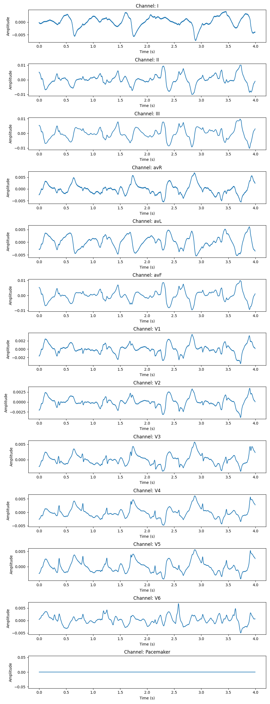

https://litfl.com/p-wave-ecg-library/
https://paulbourke.net/dataformats/edf/
https://onlinelibrary.wiley.com/doi/10.1155/2021/9913127
https://github.com/alphanumericslab/ecg-image-kit/tree/main
https://github.com/alphanumericslab/ecg-image-kit/blob/main/codes/ecg-image-generator/documentation/ECG_IMAGE_RESOLUTION.md
https://gist.github.com/emckiernan/3e7e86a48256777e9e6a44ede032d938

Limb Leads (6):

I, II, III (augmented vectors: aVR, aVL, aVF).

Precordial Leads (6):

V1, V2, V3, V4, V5, V6.

Rhythm Strip (1):

Usually Lead II for continuous monitoring.

1. P Wave
What it measures: Atrial depolarization.

Leads used:

Best seen in: Lead II (limb lead) and V1 (chest lead).

Lead II is ideal for assessing morphology (e.g., peaked P waves in right atrial enlargement).

2. RR Interval
What it measures: Time between two R waves (heart rate calculation).

Leads used:

Rhythm strip (Lead II) for consistency.

Can be measured in any lead, but Lead II is standard for rhythm analysis.

3. PP Interval
What it measures: Time between two P waves (atrial rhythm regularity).

Leads used:

Lead II (clear P waves) or V1 (may show biphasic P waves).

4. Cardiac Axis
What it measures: Overall direction of the heart’s electrical activity.

Leads used:

Calculated using limb leads (I, II, III).

Additional confirmation with aVR, aVL, aVF.

5. PR Interval
What it measures: Atrial-to-ventricular conduction time (P wave start to QRS start).

Leads used:

Lead II (most accurate due to clear P wave and QRS onset).

6. QRS Duration
What it measures: Ventricular depolarization time.

Leads used:

Measured in the lead with the widest QRS (often V1, V2, or V5).

Limb leads (e.g., Lead I) may also be used.

7. ST Segment
What it measures: Early ventricular repolarization (ischemia/infarction detection).

Leads used:

All 12 leads, but critical in:

V2–V3: Anteroseptal ischemia.

II, III, aVF: Inferior ischemia.

I, aVL, V5–V6: Lateral ischemia.

8. QT/QTc Interval
What it measures: Total ventricular depolarization + repolarization time.

Leads used:

Lead II or V5 (least noise, clear T wave end).

9. T Wave
What it measures: Ventricular repolarization.

Leads used:

Precordial leads (V2–V6) for morphology (e.g., inverted T waves in ischemia).

Lead II and aVF for inferior T-wave changes.

Key Notes:
These features are not separate signals but waveform components analyzed within the 12 standard ECG leads (I, II, III, aVR, aVL, aVF, V1–V6).

Lead II is the most commonly used for rhythm/interval analysis (e.g., RR, PR, QT).

Precordial leads (V1–V6) are critical for localizing ischemia, QRS width, and T-wave abnormalities.

EDFViewer 5sec

